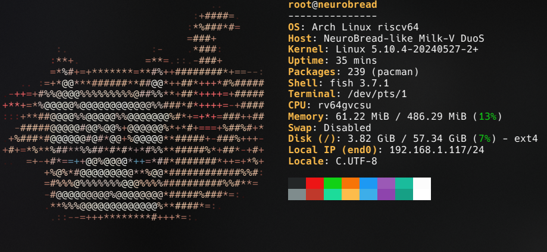

# Neurobread fastfetch config

<p align="center">
  
  
</p>

## How to use

```sh
cd ~/.local/share
git clone https://github.com/CluelessCatBurger/fastfetch-neurobread-config.git fastfetch
```

Then you can execute it with

```sh
fastfetch --config neurobread
```

of colored version

```sh
fastfetch --config neurobread-colored
```

Also, you can copy presets/neurobread.jsonc or presets/neurobread-colored.jsonc to ~/.config/fastfetch and rename it to ``config.jsonc``, it will replace your default config.

Then you can execute it with

```sh
fastfetch
```
